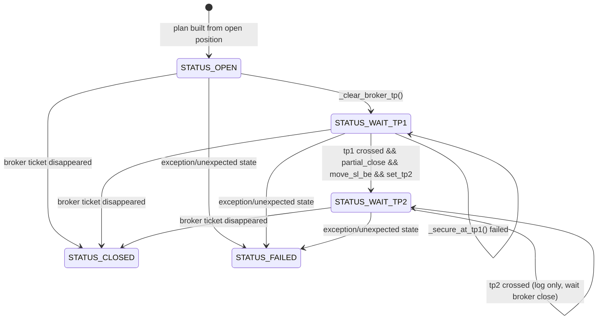
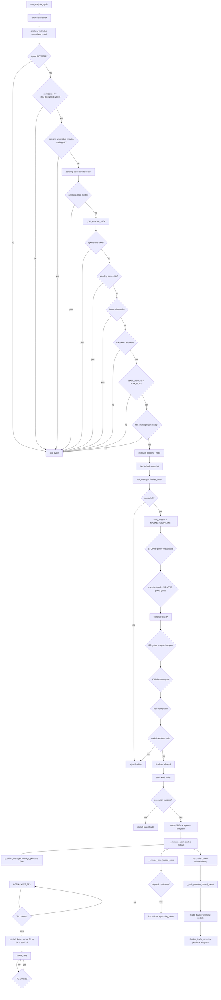

# NDS-Flow-Scalper-Bot — Architectural and Behavioral Audit

This document reverse-engineers the current runtime architecture and execution behavior from the codebase.

## SECTION 1 — SYSTEM ARCHITECTURE OVERVIEW

### 1.1 Major modules and responsibilities

#### `risk_manager` (`src/trading_bot/risk_manager.py`)
- Owns **final pre-execution decisioning** through `ScalpingRiskManager.finalize_order(...)`.
- Converts analyzer + live snapshot into `FinalizedOrderParams` via `_finalize(...)` closure.
- Selects `order_type` (`MARKET`/`STOP`/`LIMIT`/`WAIT`/`NONE`) from `entry_model` and STOP-far policy.
- Computes SL/TP geometry using `_compute_scalping_sl_tp(...)`.
- Enforces S/R gate, counter-trend gate, spread gate, deviation/ATR gate, RR gates, RR repair, TP2 autogen, and trade invariants.
- Computes lot sizing via `calculate_scalping_position_size(...)` and clamps lot to `MIN_LOT` / `MAX_LOT_SIZE`.

#### `position_manager` facade (`src/trading_bot/position_manager.py`)
- Simple re-export wrapper around deterministic FSM implementation in `position_manager_state_machine.py`.
- Declares legacy manager deprecated and enforces state-machine manager as canonical path.

#### `position_manager_state_machine` (`src/trading_bot/position_manager_state_machine.py`)
- Implements strict finite-state lifecycle for each MT5 position with `PositionPlan`.
- States: `STATUS_OPEN`, `STATUS_WAIT_TP1`, `STATUS_WAIT_TP2`, terminal `STATUS_CLOSED` / `STATUS_FAILED`.
- Handles TP1 partial close, SL-to-BE shift, TP2 placement, broker-close detection, and close summary resolution from history deals.

#### Signal generation layer (`src/trading_bot/nds/analyzer.py` used through `bot.py`)
- Analyzer invoked by `run_analysis_cycle` through `self.analyze_market_func(...)`.
- `bot.py` normalizes heterogeneous analyzer output via `_result_to_dict(...)` and `_normalize_result_dict(...)`.
- Top-level signal filtering in bot: reject non-directional, confidence below threshold, untradable session, auto-trading disabled.

#### Reporting / persistence layer
- `execution_reporting.py`: writes per-event JSONL and summary JSON under reports path via `generate_execution_report(...)`.
- `trade_tracker.py`: in-memory lifecycle ledger (`active_trades`, `pending_closes`, `closed_trades`) with reconciliation helpers and pending-close backoff logic.
- `position_state.py`: durable state store (`reports/state/positions.json`) for open/partial/closed positional continuity across restarts.

#### Cooldown logic (`src/trading_bot/cooldown.py`)
- `evaluate_cooldown(...)` blocks entries when exposure exists, mixed exposure exists, or minimum candle spacing not met.
- Candle spacing uses UTC-normalized candle times and `last_trade_candle_time` from `BotState`.

#### RR validation logic (primarily in `risk_manager.finalize_order`)
- RR mode selected via `SCALP_RR_MODE` / `rr_validate_mode` (TP1 vs TP2_ONLY behavior).
- Pre-approval RR gate (`PRE_APPROVAL_RR_GATE_ENABLED`) and final RR gate.
- RR repair pathways: `_attempt_rr_repair(...)`, `_attempt_rr_repair_tp2(...)`, TP2 autogen path.

#### Time-based exit enforcement (`bot.py`)
- `_enforce_time_based_exits(...)` force-closes aged positions based on `POSITION_TIMEOUT_MINUTES` (fallback M5->60m else 120m).
- Moves timed-out trades into `pending_closes` for reconciled terminal attribution.

#### Centralized finalization logic (`bot.py`)
- `_emit_position_closed_event(...)` is central terminal-event constructor for all close outcomes.
- Computes pips, duration, TP attribution (`tp_level_hit`), metadata merge, close status (`CLOSE`/`CLOSE_UNKNOWN`).
- Calls either `trade_tracker.close_trade_event(...)` or `finalize_unknown_close(...)` and then `finalize_trade_report(...)` (report + telegram).

### 1.2 Data flow between modules

1. `run_analysis_cycle(...)` obtains OHLCV from MT5.
2. Analyzer produces structural signal payload.
3. Bot normalizes signal and applies top-level non-risk gates.
4. Exposure + cooldown gate checked in `_can_execute_trade(...)`.
5. `execute_scalping_trade(...)` retrieves live bid/ask and calls `risk_manager.finalize_order(...)`.
6. Finalized payload drives actual MT5 order submission.
7. `OPEN` event emitted to `trade_tracker`; `generate_execution_report(...)` persists report.
8. Monitoring loop `_monitor_open_trades(...)` reconciles broker state and invokes `PositionManager.manage_positions(...)`.
9. On closure detection, `_emit_position_closed_event(...)` creates terminal event and writes reports + notifications.

### 1.3 Entry points of execution

- Process entrypoint: `main.py -> main()`.
- Bot lifecycle entrypoint: `NDSBot.run()` loop (continuous cycles, sleeps by configured analysis interval).
- Per-cycle decision entrypoint: `run_analysis_cycle(cycle_number)`.
- Trade execution entrypoint: `execute_scalping_trade(signal_data, df)`.
- Monitoring entrypoint: `_maybe_monitor_trades(force=False)` throttled scheduler.

### 1.4 Event-driven vs polling behavior

- **Polling-based**:
  - Main analysis loop (`run` + periodic sleep).
  - Trade monitor loop `_maybe_monitor_trades` every `_trade_monitor_interval_sec`.
  - Position reconciliation / pending-close history fetch retries.
- **Event-driven inside poll ticks**:
  - FSM transitions triggered by observed `market_price` crossing TP1/TP2.
  - Close event finalization triggered when open ticket disappears or timeout occurs.

### 1.5 Decision vs execution boundaries

- Decision-heavy layers:
  - Analyzer (`signal`, `entry_idea`, context).
  - `risk_manager.finalize_order` (gate stack + geometry + RR + lot + order type).
  - `_can_execute_trade` (exposure/cooldown gate).
- Execution-only layers:
  - MT5 client order calls (`send_order_real_time`, `send_order`, pending methods).
  - PositionManager methods invoking `close_position` / `modify_position`.
  - Reporting and notifier emissions.

---

## SECTION 2 — COMPLETE TRADE ENTRY LOGIC

### 2.1 Signal detection

In `run_analysis_cycle(...)`:
1. Fetch history: `df = self.mt5_client.get_historical_data(...)`.
2. Run analyzer: `raw_result = self.analyze_market_func(...)`.
3. Normalize result to dict.
4. Derive `analyzer_signal`, `score`, `confidence`, session payload and quality fields.
5. Build `final_signal` with sequential checks:
   - if analyzer signal not BUY/SELL -> `NONE`.
   - if `confidence < MIN_CONFIDENCE` -> `NONE`.
   - if session `untradable` -> `NONE`.
   - if auto-trading disabled -> `NONE`.

### 2.2 Validation gates in runtime order

There are two gate stacks: bot-level then risk-manager-level.

#### A) Bot-level pre-execution gates (`run_analysis_cycle` + `_can_execute_trade`)
1. pending close gate (`trade_tracker.get_pending_close_tickets_for_symbol`) blocks if unresolved terminal reconciliations exist.
2. exposure gate (`_can_execute_trade`): blocks same-side open positions.
3. pending-order gate (`_can_execute_trade`): blocks same-side pending orders.
4. intent mismatch gate (`trade_tracker.reconcile_with_pending_orders`) blocks if internal pending intent ledger diverges.
5. cooldown gate (`evaluate_cooldown`) blocks by exposure/mixed/candle spacing.
6. max positions gate (`open_positions >= MAX_POS`) blocks.
7. risk-manager `can_scalp(...)` macro permission gate blocks.

#### B) Risk manager gate stack (`finalize_order`) exact sequence
1. signal actionable gate (reject NONE/NEUTRAL).
2. live snapshot gate (`bid/ask` required).
3. spread gate (`spread_pips <= SPREAD_MAX_PIPS`).
4. planned entry existence gate.
5. config integrity gate (`MIN_RR_RATIO` exists).
6. entry type resolve from `entry_model` -> `order_type`.
7. STOP-far policy (`_apply_stop_far_from_market_policy`) for STOP entries.
8. STOP revalidation threshold gate (`STOP_REVALIDATE_PIPS`) for STOP.
9. STOP/LIMIT immediate-trigger normalization to MARKET.
10. counter-trend confirmation gate.
11. static S/R gate (with optional override helper).
12. TP1-target policy gate (`_apply_tp1_target_policy`, can reject).
13. SL/TP compute (`_compute_scalping_sl_tp`).
14. structural-stop-exceeds-max reject.
15. distance sanity check reject.
16. TP execution mode derivation and RR-mode derivation.
17. pre-approval RR gate (`PRE_APPROVAL_RR_GATE_ENABLED`).
18. ATR-deviation gate (`MAX_ENTRY_ATR_DEVIATION`).
19. geometry positivity gate (`sl_distance > 0` and `tp_distance > 0`).
20. RR validation + RR repair / TP2 autogen / TP1-only fallback depending on mode.
21. position size validation gate (`calculate_scalping_position_size(...).validation_passed`).
22. invariant gate (`_enforce_trade_invariants`).
23. min/max lot clamps + TP1 partial-viability virtual-trigger adjustment.
24. final allow.

### 2.3 Entry type selection logic

#### MARKET
Conditions:
- `entry_model` not STOP/LIMIT, or STOP/LIMIT normalized to market due to in-the-money trigger:
  - STOP BUY with `entry_price <= ask` -> MARKET.
  - STOP SELL with `entry_price >= bid` -> MARKET.
  - LIMIT BUY with `entry_price >= ask` -> MARKET.
  - LIMIT SELL with `entry_price <= bid` -> MARKET.
- Also in bot layer, any `order_type == "stop"` is currently force-routed to market send path with warning.

#### STOP (near)
Conditions:
- `entry_model == STOP` and deviation is acceptable.
- `_apply_stop_far_from_market_policy` returns `None` (SKIP branch) or CAP_ENTRY with order type STOP.
- Optional STOP revalidation passes.

#### STOP (far)
Conditions:
- `entry_model == STOP` and `deviation_pips >= STOP_MAX_DEVIATION_PIPS`.
Policy outcomes by regime:
- hard reject if `deviation_pips >= STOP_HARD_REJECT_PIPS`.
- trend continuation (`adx >= TREND_STRENGTH_ADX_MIN`) -> CAP_ENTRY and keep STOP.
- mean reversion (`adx <= MEAN_REVERSION_ADX_MAX` or low volatility):
  - if confidence below `LIMIT_ORDER_MIN_CONFIDENCE` -> WAIT reject-like non-trade.
  - else convert to LIMIT with distance `STOP_CONVERT_TO_LIMIT_PIPS`.
- else REJECT_NO_REGIME.

### 2.4 SL/TP computation per entry type

SL/TP are independent of order type (computed after final `entry_price`), via `_compute_scalping_sl_tp`:
- SL distance sources:
  - ATR distance (`atr * SCALP_ATR_SL_MULT`).
  - recent candle ref distance (`entry-recent_low` for BUY / `recent_high-entry` for SELL).
  - optional structural anchor from nearest support/resistance with buffer.
- Model mode:
  - `SL_MODEL_SCALP == MIN_OF`: min of cap/ref/atr/structural candidates.
  - else precedence: structural > min(atr,ref) > atr > ref.
- SL pips clamped to `[SL_MIN_PIPS(or MIN_SL_PIPS), SL_MAX_PIPS_SCALP]`.

TP1:
- Base from `TP1_PIPS` (or `COUNTERTREND_TP1_PIPS` in counter-trend).
- Optional opposing structure target (`tp1_target_price`) with `FLOW_TP1_USE_OPPOSING_STRUCTURE`.
- RR floor protection when not preserving TP1 (`FLOW_TP1_MIN_RR`) to avoid RR collapse.

TP2:
- Base from `TP2_PIPS` if enabled.
- Enforced to be sufficiently beyond TP1 via `min_gap_pips = max(15, TP2_MIN_GAP_PIPS)` and at least `tp1 * 1.2`.

ATR influence:
- Directly in SL distance through ATR multiplier.
- Also in RR-repair cap checks (`RR_REPAIR_MAX_TP_ATR_MULT`, TP2 autogen ATR caps).

RR geometry protection:
- pre-approval RR gate.
- final RR gate with epsilon.
- RR repair / TP2 autogen / TP1-only rejection.
- invariant enforcement after sizing.

Edge cases:
- Missing bid/ask, missing entry idea/config => hard reject.
- Structural stop exceeding max cap => reject.
- TP2 missing under TP2_ONLY mode may trigger autogen; if impossible and RR insufficient => reject.
- Partial close infeasible due to min lot => `tp1_virtual_trigger=True` (TP1 acts as virtual milestone only).

---

## SECTION 3 — POSITION LIFECYCLE (STATE MACHINE)

### 3.1 States
`PositionStatus` enum:
- `STATUS_OPEN`
- `STATUS_WAIT_TP1`
- `STATUS_WAIT_TP2`
- `STATUS_CLOSED`
- `STATUS_FAILED`

### 3.2 Transitions and triggers
1. `STATUS_OPEN -> STATUS_WAIT_TP1`
   - Trigger: first `_run_fsm_tick` after plan build.
   - Action: `_clear_broker_tp(plan)`.

2. `STATUS_WAIT_TP1 -> STATUS_WAIT_TP2`
   - Trigger: `_crossed_tp1(...)` true.
   - Guard: `_secure_at_tp1(plan)` returns true.
   - `_secure_at_tp1` sub-steps (all required):
     - `_partial_close` success (unless already partial closed).
     - `_modify_sl` to BE+cover pips success (unless already moved).
     - `_set_tp2` success.

3. `STATUS_WAIT_TP1 -> STATUS_WAIT_TP1` (self/hold)
   - Trigger: TP1 not crossed or any `_secure_at_tp1` step fails.

4. `STATUS_WAIT_TP2 -> STATUS_WAIT_TP2` (hold)
   - Trigger: TP2 not crossed.

5. `STATUS_WAIT_TP2` no explicit terminal transition on TP2 cross
   - Current behavior logs TP2 reached and returns; terminal close comes from broker disappearance path.

6. Any active state -> `STATUS_CLOSED`
   - Trigger: ticket missing from current open positions in `manage_positions`.
   - Action: `_handle_broker_closed` with history resolution + trade tracker pending-close registration.

7. Any state -> `STATUS_FAILED`
   - Trigger: exception or unexpected state branch.

### 3.3 Partial close details
- Partial requested volume: `plan.volume * FLOW_TP1_PARTIAL_CLOSE_PCT`.
- Rounded down to lot step (`_floor_to_step`).
- If remaining volume drops below min, escalates to full close attempt.
- Rejects if close volume invalid against min volume and remaining constraints.
- Executes via `close_position` (fallback `partial_close`).
- On success records metadata via `trade_tracker.register_partial_close(...)`.

### 3.4 Break-even (SL to BE)
- BE price = `entry_price ± pips_to_price(FLOW_TP1_MOVE_SL_TO_BE_PLUS_PIPS, point_size)` by direction.
- Applied once after TP1 partial close.

### 3.5 Trailing behavior
- In this FSM file there is **no active dynamic trailing algorithm** after TP1.
- Strategy metadata can carry `trail_after_tp1`, but manager only sets TP2 and BE; no iterative trailing stop adjustment logic is implemented.

### 3.6 Time-based exit enforcement
- Outside FSM, in bot monitor path `_enforce_time_based_exits(...)`.
- If elapsed >= timeout, bot calls MT5 `close_position` and registers pending close for deterministic finalization.

### 3.7 Forced close trigger
- Triggered by timeout (`RISK_TIMEOUT`) in monitor loop.
- Not immediate final close event; first enters pending-close queue, then history reconciliation closes with `CLOSE` or timeout fallback `CLOSE_UNKNOWN`.

### 3.8 `CLOSE_UNKNOWN` elimination status
- `CLOSE_UNKNOWN` is **not eliminated** in current code.
- It remains a terminal type in `ExecutionEvent`, reporting summary, and timeout fallback path (`pending_timeouts` branch).

### 3.9 Central finalization behavior
- All reconciled closes use `_emit_position_closed_event(...)`.
- This function unifies:
  - exit_price/profit/reason selection,
  - pips computation,
  - duration computation,
  - TP attribution,
  - tracker terminal mutation,
  - report generation,
  - telegram close notification.

### 3.10 Mermaid reconstruction

---

## SECTION 4 — RISK ENGINE DETAILS

### 4.1 Position sizing formula
Inside `calculate_scalping_position_size(...)`:
1. Validate parameters (`_validate_scalping_parameters`).
2. Compute SL distance (`abs(entry-stop_loss)`).
3. Determine `max_risk_usd` (`_get_max_scalping_risk_usd` if not provided).
4. Compute base risk percent from confidence (`_calculate_scalping_risk_percent`).
5. Multiply by session, volatility, and history multipliers.
6. Clamp by risk limits (`_apply_scalping_risk_limits`).
7. `risk_amount = min(account_equity * final_risk_percent / 100, max_risk_usd)`.
8. `lot_size = _calculate_scalping_lot_size(...)`.

### 4.2 Lot computation and min/max handling
- Finalize path clamps lot against:
  - `min_lot = GOLD_SPEC.MIN_LOT`
  - `max_lot = min(GOLD_SPEC.MAX_LOT, risk_manager_config.MAX_LOT_SIZE)` when max configured.
- Step rounding logic exists (`_round_volume`) and is used for TP1 partial feasibility checks.

### 4.3 Risk % vs SL distance interaction
- Smaller SL distance generally yields larger lot for same `risk_amount` in `_calculate_scalping_lot_size`.
- Risk amount itself is bounded by confidence/session/volatility/history and max risk caps.

### 4.4 Partial close rounding
- FSM partial close floors close/remaining to lot step.
- Rejects invalid split; may convert to full close if remainder under min volume.

### 4.5 RR below minimum handling
- Pre-approval RR gate can reject early.
- If still below minimum after geometry:
  - RR repair off => reject.
  - TP2-only repair path adjusts TP2 if caps allow; else reject.
  - legacy TP1 repair path expands TP1 within configured caps.
- `RR_EPSILON` used to avoid floating-point edge rejections.

### 4.6 STOP near RR collapse prevention
- STOP-far policy can cap or convert entry to avoid extreme deviation regime mismatch.
- TP1 opposing-structure logic enforces `min_rr` floor unless `SCALP_PRESERVE_TP1` is enabled.
- Additional pre-approval RR gate ensures minimum RR prior to sizing and submission.

---

## SECTION 5 — TIME & COOLDOWN HANDLING

### 5.1 Timestamp normalization
- `parse_timestamp(...)` parses datetime/epoch/string into UTC-aware datetime.
- `to_utc_time(...)` and `to_broker_time(...)` convert by selected mode (`BROKER` vs `UTC`).

### 5.2 UTC normalization in cooldown
- `cooldown._normalize_utc(...)` -> `parse_timestamp` then `to_utc_time(..., time_mode="UTC")`.
- Candle series normalized via pandas `to_datetime(..., utc=True)` fallback.

### 5.3 Candle counting
- `candles_passed = int((candle_times > last_trade_time).sum())`.
- In non-vectorized fallback, explicit iteration count of normalized timestamps > last trade.
- Blocks when `candles_passed <= min_candles_between`.

### 5.4 How cooldown blocks entries
`evaluate_cooldown(...)` rejects in order:
1. `MIXED_EXPOSURE` if both buy/sell open.
2. `EXPOSURE_PRESENT` if any open or pending exists.
3. (if no last trade or min=0) allows `NO_COOLDOWN`.
4. if no candles dataset allows `NO_CANDLES`.
5. else checks candle delta and can return `COOLDOWN_BLOCKED`.

### 5.5 `last_trade_candle_time` derivation
- Set when successful trade executes in `run_analysis_cycle`: `self.bot_state.set_last_trade_times(..., candle_time=df["time"].iloc[-1])`.
- Used in cooldown only when `last_trade_direction == signal`.

### 5.6 `open_positions[].open_time` usage
- Cooldown helper can derive last same-side open time from current positions.
- Time-based exit enforcement uses `position.open_time` primarily, then falls back to tracker identity `opened_at`.

---

## SECTION 6 — REPORTING & FINALIZATION

### 6.1 Trade persistence
- `generate_execution_report` writes:
  - event log JSONL (`all_events_YYYY-MM-DD.jsonl`),
  - per-ticket timeline JSONL,
  - per-ticket summary JSON.
- `PositionStateStore.save()` persists open-state map to `reports/state/positions.json`.

### 6.2 Profit calculation location
- On closure reconciliation, `_emit_position_closed_event` uses broker history `total_profit` when available.
- Position manager history resolver sums deal profits in `_resolve_close_from_history`.
- `trade_tracker.close_trade_event` updates daily aggregates.

### 6.3 Duration computation
- `_normalize_duration_seconds(opened_at, close_time)` gives non-negative seconds.
- Stored in close event metadata (`duration_sec`) and forwarded to telegram notifier.

### 6.4 Final state determination
- Close status argument is either:
  - `CLOSE` (history resolved),
  - `CLOSE_UNKNOWN` (pending close timeout / unknown history).
- Report summary marks status closed for both values.

### 6.5 Notification path
- Open notification sent right after successful order placement.
- Close notification sent from `finalize_trade_report` after terminal event emission.
- Partial close notification sent in monitor when `position_state` detects volume delta.

### 6.6 Centralized finalizer consistency guarantees
`_emit_position_closed_event(...)` centralization guarantees:
- one canonical event schema for terminal outcomes,
- merged metadata for TP attribution and RR context,
- deterministic tracker mutation before reporting,
- single place for terminal telegram dispatch.

---

## SECTION 7 — FAILURE & EDGE CASE ANALYSIS

### 7.1 Possible race conditions
1. Monitor tick vs FSM tick vs close reconciliation timing:
   - position may disappear between FSM management and history retrieval.
2. Pending-close retry windows can overlap with late broker history availability.
3. Order execution fields (`entry/sl/tp`) may be zero initially and later reconciled; interim metadata can be incomplete.

### 7.2 Orphaned position risks
- If trade tracker misses open intent and recovery scan matching fails, position can be under-attributed until reconciliation path reconstructs record.
- `PositionStateStore` mitigates restart orphaning but does not guarantee perfect identity metadata.

### 7.3 Double-close risks
- Time-based close calls `close_position` then registers pending close.
- If broker/manual close already happened near-simultaneously, duplicate close attempts may log failures (guarded by success checks and pending map).

### 7.4 Inconsistent report risks
- `CLOSE_UNKNOWN` path deliberately finalizes without full history; profit/exit reason may be less accurate.
- If history arrives after unknown finalization, there is no automatic retroactive rewrite shown in current logic.

### 7.5 Redundant logic / contradictions
- STOP handling contradiction: risk manager may return STOP/LIMIT, but bot execution branch currently force-routes STOP to market with warning (`[BREAKOUT_WATCH][UNEXPECTED] ... forcing_market`).
- `CLOSE_UNKNOWN` still active despite any prior intention to eliminate it.
- Trailing-after-TP1 metadata exists but no active trailing algorithm in position manager.

### 7.6 Dead / overly complex branching indicators
- `finalize_order` is monolithic with many nested guards and policy branches; high cyclomatic complexity and policy coupling.
- Multiple RR modes + repair/autogen paths introduce overlapping behavior and difficult auditability.

---

## SECTION 8 — FLOWCHART

---

## Ambiguities explicitly flagged

1. STOP orders are modeled in risk manager but bot execution currently force-markets STOP branch; intended architecture appears transitional.
2. `CLOSE_UNKNOWN` exists as active final status despite any conceptual objective to remove it.
3. TP2 cross in FSM is observational/log-only; terminal state depends on external broker-close reconciliation.
4. No explicit, active trailing stop algorithm after TP1 in FSM despite metadata suggesting this feature.

